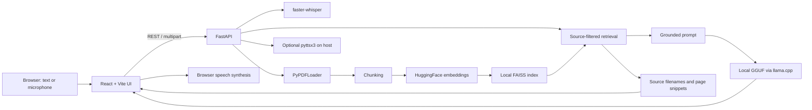

# Local Voice & Text RAG Assistant

A local-first voice and text Retrieval-Augmented Generation (RAG) application for asking questions about uploaded PDFs. The browser talks to a local FastAPI service; embeddings, retrieval, GGUF generation, speech-to-text, and optional text-to-speech are designed to run on the host machine after the required models and dependencies are installed.

The first setup may download Python packages and model weights. “Local-first” describes the application architecture, not a guarantee about every machine, browser, or network configuration.

---

## ✨ Key Features

- **Voice & Text Interaction**: Ask questions using voice via browser microphone or type queries directly.
- **Local Speech-to-Text**: Transcription powered by `faster-whisper` running on the backend host.
- **Local Retrieval-Augmented Generation**: PDF ingestion and chunking with local FAISS vector embeddings (`sentence-transformers`).
- **Local LLM Inference**: GGUF model execution using `llama-cpp-python` with streaming token responses.
- **Local Text-to-Speech**: Optional TTS output via `pyttsx3`.
- **Modern Web Interface**: Built with React, Vite, and custom CSS for an interactive user experience.

---

## Architecture & workflow



The response path is intentionally inspectable: `input → retrieval → prompt → streamed answer`, with retrieved source metadata returned before the answer stream.

---

## 📁 Repository Structure

```text
local-voice-rag/
├── backend/                # Python FastAPI Backend & RAG Pipeline
│   ├── models/             # Directory for local .gguf LLM models (git-ignored)
│   ├── vectorstore/        # Local FAISS vector index (git-ignored)
│   ├── uploads/            # Uploaded PDFs and documents (git-ignored)
│   ├── local_llm.py        # Local LLM wrapper & streaming generation
│   ├── rag_core.py         # Document ingestion, embedding, & FAISS indexing
│   ├── voice_input.py      # Local Whisper STT transcription
│   ├── voice_output.py     # Local TTS speech generation
│   ├── main.py             # FastAPI REST API endpoints
│   ├── requirements.txt    # Python dependencies
│   └── .env.example        # Environment variable template
├── frontend/               # React + Vite Web Frontend
│   ├── src/                # React UI components & API layer
│   ├── package.json        # Node dependencies & npm scripts
│   └── vite.config.js      # Vite build configuration
├── .gitignore              # Repository ignore rules
└── README.md               # Project documentation
```

---

## 🚀 Quick Start Guide

### 1. Backend Setup

1. **Navigate to the backend directory:**
   ```bash
   cd backend
   ```
2. **Create and activate a Python virtual environment:**
   ```bash
   python -m venv venv
   # On Windows:
   venv\Scripts\activate
   # On macOS/Linux:
   source venv/bin/activate
   ```
3. **Install dependencies:**
   ```bash
   pip install -r requirements.txt
   ```
4. **Download an LLM model (`.gguf`):**
   - Place your desired `.gguf` model file inside `backend/models/` (e.g., `phi-3-mini-4k-instruct-q4.gguf`).
   - If using a different model filename, update `MODEL_PATH` in `backend/local_llm.py` or specify it in your `.env` file.
5. **Configure environment variables (optional):**
   - Copy `.env.example` to `.env`:
     ```bash
     cp .env.example .env
     ```
6. **Start the FastAPI server:**
   ```bash
   uvicorn main:app --host 0.0.0.0 --port 8000 --reload
   ```

---

### 2. Frontend Setup

1. **Navigate to the frontend directory:**
   ```bash
   cd frontend
   ```
2. **Install Node dependencies:**
   ```bash
   npm install
   ```
3. **Start the development server:**
   ```bash
   npm run dev
   ```
4. **Open the App:**
   - Navigate to `http://localhost:5173` in your web browser.

---

## Evaluation

The `eval/` directory contains a small retrieval harness for Recall@1/3/5 and MRR. It accepts an explicit question set plus captured retrieval results, or it can query an available local FAISS index. It never invents benchmark results; no score is claimed here until a question set and result artifact are produced.

```bash
python eval/retrieval_eval.py \
  --questions eval/questions.example.json \
  --results path/to/retrieval-results.json
```

## Security, privacy, and limitations

- Uploaded PDFs and audio are streamed through bounded request limits and PDF uploads must have a PDF signature; do not expose the development server directly to an untrusted network.
- The generated FAISS index is loaded with LangChain’s dangerous-deserialization option because it is an application-local artifact. Treat `backend/vectorstore/` as trusted local state and do not load an index from an untrusted source.
- There is no authentication or multi-user isolation in this prototype. Model quality, latency, and memory use depend on the selected GGUF/Whisper models and available CPU/GPU resources.
- PDF parsing, retrieval, transcription, and generation can fail independently; public API errors are intentionally generic while details remain in backend logs.

The repository `.gitignore` excludes environment files, user documents, vector stores, model weights, caches, and local audio. Review deployment and machine-level privacy settings separately.

## Roadmap

- Add a committed, reviewable retrieval question set and publish measured results.
- Add model capability checks and clearer startup diagnostics for CPU/GPU and missing weights.
- Add authentication and per-user document isolation before any shared deployment.
- Expand document-format support only after the PDF path has stronger end-to-end coverage.

---

## 📝 License

This project is licensed under the MIT License.
